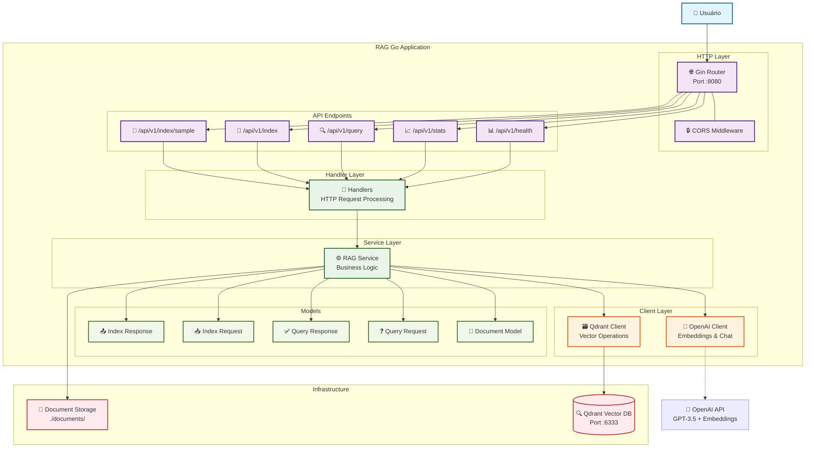
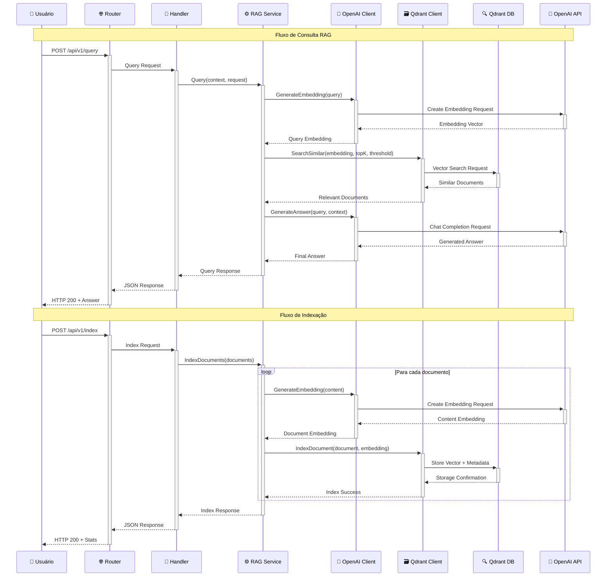
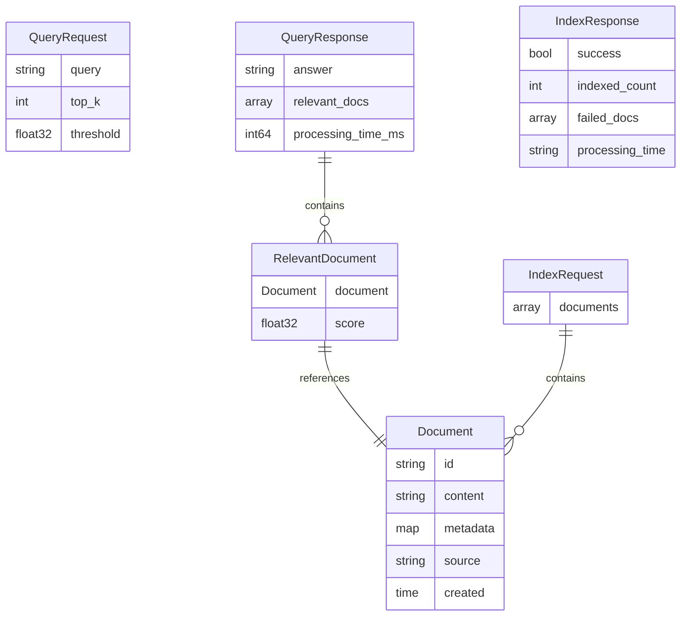
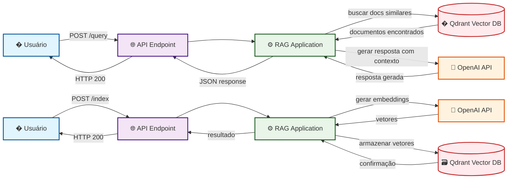

# Diagrama de Arquitetura - RAG Go Application

## Arquitetura Geral do Sistema

## Fluxo de Processamento RAG

## Estrutura de Dados

## Flowchart Simples do RAG

## Componentes e Responsabilidades

### 🌐 **HTTP Layer (Gin Router)**

- Roteamento de requisições HTTP
- Middleware de CORS
- Parsing de parâmetros e JSON

### 🎯 **Handler Layer**

- Validação de requests
- Binding de JSON para structs
- Tratamento de erros HTTP
- Logging de requisições

### ⚙️ **RAG Service**

- Lógica de negócio principal
- Orquestração entre OpenAI e Qdrant
- Processamento de documentos
- Geração de respostas contextuais

### 🧠 **OpenAI Client**

- Geração de embeddings (text-embedding-ada-002)
- Geração de respostas (GPT-3.5-turbo)
- Rate limiting e error handling

### 🗃️ **Qdrant Client**

- Operações de busca vetorial
- Indexação de documentos
- Gerenciamento de coleções
- Filtros e threshold de similaridade

### 📄 **Models**

- Estruturas de dados compartilhadas
- Validação de requests
- Serialização JSON

## Endpoints da API

| Método | Endpoint | Descrição |
|--------|----------|-----------|
| `GET` | `/` | Informações da API |
| `GET` | `/api/v1/health` | Health check |
| `GET` | `/api/v1/stats` | Estatísticas do sistema |
| `GET` | `/api/v1/query?q=...` | Query rápida via GET |
| `POST` | `/api/v1/query` | Query principal RAG |
| `POST` | `/api/v1/index` | Indexar documentos |
| `POST` | `/api/v1/index/sample` | Indexar dados de exemplo |

## Tecnologias Utilizadas

- **Language**: Go 1.21+
- **Web Framework**: Gin
- **Vector Database**: Qdrant
- **AI Service**: OpenAI (GPT-3.5 + Embeddings)
- **Logging**: Logrus
- **Containerization**: Docker & Docker Compose
- **Configuration**: Environment Variables (.env)
